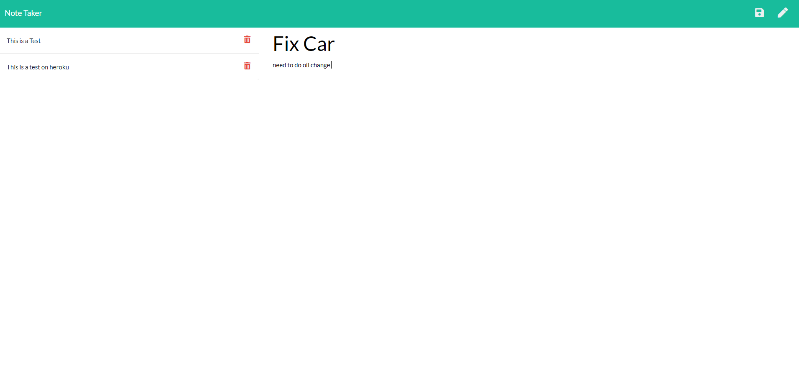

# Note Taker
  
  
## Description 
  
Using Node js and express js, this project will deployed with heroku. This project is a simple note app where user can type the title of their note and the actual note and save it to the server. The app also have a delete option where user can delete unwanted note.


## Table of Contents

* [Installation](#Installation)
* [Usage](#Usage) 
* [Contributing](#Contributing)
* [License](#License)
* [Questions](#Questions)
  

## Installation 
  
Please run the following command to install required software:

```
This project is deployed to heroku therefore no installation require
```


## Usage

These are the technologies and languages use for this project: 

* Node.js
* Express.js

Deployed GitHub Link:   https://github.com/vinhkhamhuynh/note-taker

Github Repository Link: https://vhuynh-note-taker.herokuapp.com/
  

  
   
## License 
  


 
This project is licensed under the MIT license. For more information, click here: https://spdx.org/licenses/MIT.html 
 


## Questions
  
Please follow me on Github for more projects: [vinhkhamhuynh](https://github.com/vinhkhamhuynh) 

For any questions or to report issues, please email me at: vinhkhamhuynh@gmail.com
  

